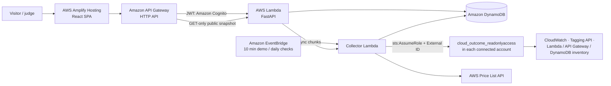

# CloudOutcome

**Turn cloud spend into business KPIs you can prove.**

CloudOutcome connects AWS accounts read-only, measures real usage in Amazon CloudWatch across every
enabled Region, prices it with the public AWS Price List API, and combines it with business inputs
(revenue, satisfaction, orders) into KPIs, KPI lineage and "today's actions" that a business owner can read.

- **Live demo:** https://live.d36mad0w24pzf7.amplifyapp.com — opens in a preset demo, no sign-in needed
- **Demo company:** *santacloth*, a fictional apparel retailer whose three storefronts (kids, adult,
  senior) run on real AWS resources tagged `outcome=<store>` and receive synthetic orders every five minutes
- Built for the AWS *Zero to Shipped* hackathon with coding agents (Codex and Claude Code) connected to AWS

> Costs shown are estimates from public on-demand list prices, not a bill: Free Tier, credits, discounts
> and taxes are excluded. Because no billing API is used, it also works in accounts where an
> organization policy blocks Cost Explorer.

## Repository layout

The project was developed and deployed as **three independent AWS CodeCommit repositories**, each with its
own specification, security rules and tests. They are combined here as top-level folders.

| Folder | Original repository | What it contains |
| --- | --- | --- |
| [`frontend/`](frontend/) | `outcomelens-frontend` | React + TypeScript (Vite) single-page app hosted on AWS Amplify: executive summary, Business KPIs with a KPI builder, KPI lineage, live AWS estimate, multi-account connection, KPI studio, onboarding guide, JSON/HTML/PDF export. Korean/English, mobile layout. Also ships the read-only connection role template (`public/outcomelens-readonly-role.json`). |
| [`backend/`](backend/) | `outcomelens-backend` | FastAPI on AWS Lambda (Python 3.14, Mangum). KPI engine, Cognito-protected workspaces, 7-day anonymous workspaces, multi-account fleet management (`fleet.py`), multi-Region CloudWatch collection and Price List pricing (`aws_live.py`), DynamoDB storage (`cloud_store.py`), privacy guards, scheduled tasks. |
| [`infra/`](infra/) | `outcomelens-infra` | AWS CDK (JavaScript) and the delivery pipeline: CodeCommit repositories, CodePipeline V2 + CodeBuild + CodeDeploy (dev → validation → prod), the parameterized platform stack (Amplify, Cognito, API Gateway, Lambda, DynamoDB, EventBridge, alarms), the santacloth demo workload, deployment scripts and the canonical product/security/deployment specs (`spec/`). |

Each folder keeps its own `README.md`, `SPEC.md`, `SECURITY.md` and tests. `AGENTS.md` / `CLAUDE.md` are the
short instructions the coding agents followed inside each module.

## Architecture



Delivery: **CodeCommit** (3 repos) → **CodePipeline V2** → **CodeBuild** (tests, Linux packaging, cross-repo
contract check, immutable release manifest) → **CloudFormation** dev → validation → prod, with an
**AWS CodeDeploy** pre-traffic hook and a 10 % / 1-minute canary that rolls back on **CloudWatch** alarms.

## Run locally

Prerequisites: Node.js 22+, Python 3.14 with [uv](https://docs.astral.sh/uv/), AWS CLI (optional, for live data).

```sh
# backend — synthetic data only
cd backend && tools/dev.sh
# backend — live views read your own AWS profile (read-only calls)
cd backend && tools/dev.sh --profile <your-aws-profile> --region us-east-1

# frontend (another terminal) — http://127.0.0.1:5173
cd frontend && npm ci && npm run dev
```

No account IDs, profiles or Regions are hard-coded; they are passed as arguments or environment variables.

## Tests

```sh
cd backend  && uv venv --python 3.14 .venv && uv pip install --python .venv/bin/python -r requirements-tested.txt -r requirements-aws-test.txt && .venv/bin/python -m pytest -q
cd frontend && npm ci && npm test && npm run build
cd infra    && npm ci && npm test
cd infra    && python -m pytest -q ci/tests        # with requirements-ci.txt installed
```

At release: backend 103, frontend 32, infrastructure 26 and deployment-script 20 tests passing.

## Deploy (summary)

See [`infra/README.md`](infra/README.md) and [`infra/spec/DEPLOYMENT.md`](infra/spec/DEPLOYMENT.md).

1. Deploy the repository stack and push the three folders to their CodeCommit repositories.
2. Deploy the pipeline stack (`OutcomeLensDeployment`, `CAPABILITY_NAMED_IAM`); it creates the runtime
   permission boundaries and per-environment CloudFormation roles.
3. Every push to `main` builds one immutable release and promotes it dev → validation → prod.
4. Optional demo: deploy `infra/santa-demo-app.mjs` (`CloudOutcomeSantaDemo`) and the read-only role
   template in the demo account.

## Connecting an AWS account

Each account creates the IAM role **`cloud_outcome_readonlyaccess`** (exactly this name) from
[`frontend/public/outcomelens-readonly-role.json`](frontend/public/outcomelens-readonly-role.json), using
AWS CloudShell for one account or CloudFormation StackSets for an organization. The role trusts only
CloudOutcome's runtime roles and requires the workspace's External ID. It can list resources, tags and
CloudWatch metrics; it cannot write, read billing data or read application data. Delete the stack to
revoke access. Connections are checked daily and on demand; failed accounts are never collected.

## Security and privacy

- No access keys or credentials are accepted from users; cross-account access is role-based.
- Access tokens stay in browser memory (OAuth code + PKCE, TOTP MFA); anonymous workspace keys are
  stored only in the visitor's browser and only their hash on the server; temporary workspaces expire after 7 days.
- Runtime roles are least-privilege with permission boundaries; logs exclude bodies, tokens and identities.
- Pre-commit hooks and CI scan for common secret and personal-data patterns.

## How coding agents were used

- **Codex** (model served by Amazon Bedrock, connected through the AWS Agent Toolkit / MCP Proxy for AWS)
  wrote the specifications, the first MVP, security rules and the automatic promotion pipeline.
- **Claude Code** (AWS CLI on an `aws login` console session) deployed the stacks, debugged real cloud
  failures from logs and CloudTrail, and built the live AWS, multi-account, santacloth and executive-summary
  features, verifying every change locally and in a headless browser before promotion.

## Status and limits

Hackathon project. Business inputs are entered manually in the demo; priced services are Lambda,
API Gateway and DynamoDB (other services are discovered but not priced). santacloth's traffic is
synthetic by design; its AWS resources and metrics are real.
